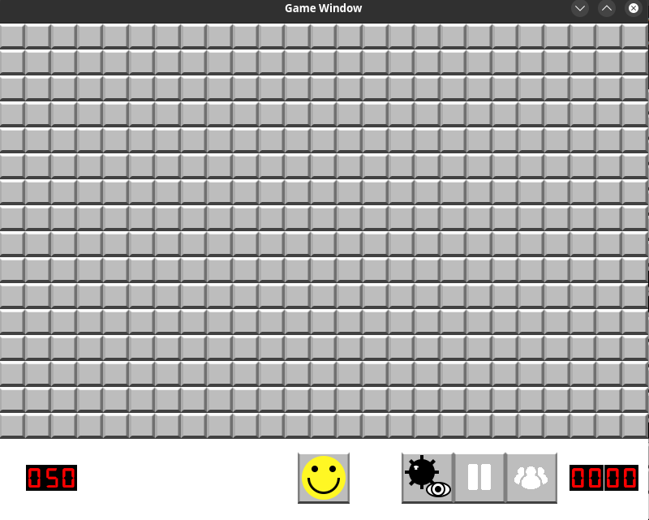

# Minesweeper


A small stuff I did by C++. This is a mimic of the famous minesweeper game. In fact, playing this game in some online platform is much easier than clone this reposity and install the required library just to run this game.

By default, the gameboard is 26x15 with 50 bombs. You can change it in board_config.cfg at will. There are three lines in this cfg file:

```
width
heigh
number_of_bombs
```

The leaderboard.txt file also play a role: displaying leaderboard. Each line contains two value: complete time and name. For example:

```
07:01,Alex
09:04,Bruce
10:03,Carl
11:24,Dan
12:15,Eve
```


Unfortunately, I coded this game long time ago and put everything into main.cpp without comments.

# Requirement

- SFML
- g++

# Build

```
g++ -c main.cpp
g++ main.o -o main -lsfml-graphics -lsfml-window -lsfml-system
```

# Run

```
./main
```